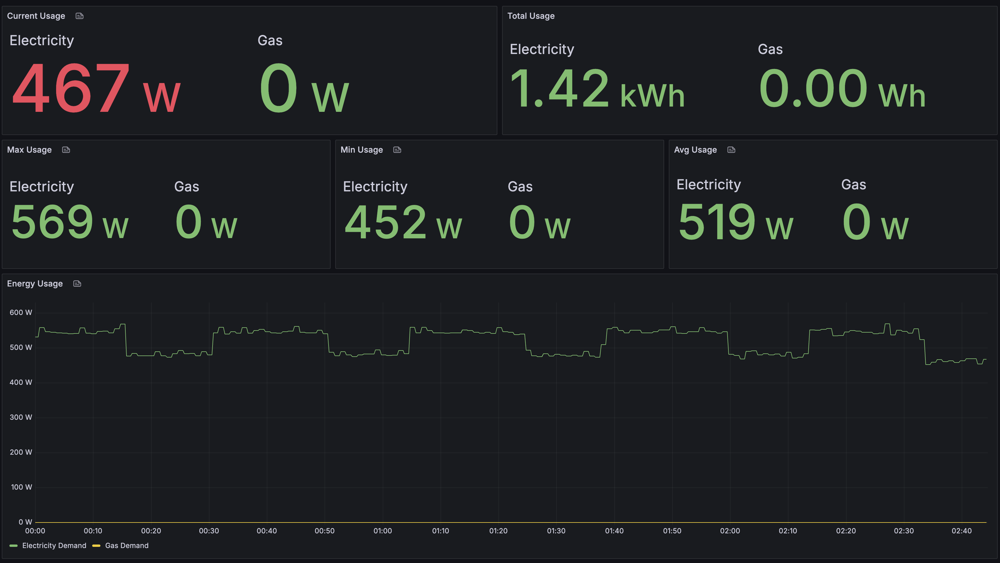

# Octopus Usage Exporter


Prometheus exporter for Octopus Energy metrics. Works best when coupled with an [Octopus Home Mini](https://octopus.energy/blog/octopus-home-mini/)

Returns:

- Consumption (Gas and Electric)
- Demand (if you have a Smart Meter) (Electric Only)
- Tariff Information (Standard and 'Smart' Half Hourly Tariffs only, 3 rate and day/night rate not currently supported)
  - Standing Charge
  - Current Unit Rate
  - Days till tariff ends


## How To Use

You will require an Octopus Energy API key: [Get your API Key](https://octopus.energy/login/?next=%2Fdashboard%2Fnew%2Faccounts%2Fpersonal-details%2Fapi-access)

And your account number, [which you can find by logging in](https://octopus.energy/dashboard/new/accounts), and it will be at the top of your Account overview page. Follows the format of `A-########` _usually_


| Environment Variable | Value        | Description                                                                                                                                                                                                                                                  |
|----------------------|--------------|--------------------------------------------------------------------------------------------------------------------------------------------------------------------------------------------------------------------------------------------------------------|
| `API_KEY`            | `abc123`     | Octopus Energy API key                                                                                                                                                                                                                                       |
| `ACCOUNT_NUMBER`     | `A-ABC12E04` | Octopus Energy Account number                                                                                                                                                                                                                                |
| `PROM_PORT`          | `9120`       | Prometheus Port                                                                                                                                                                                                                                              |
| `INTERVAL`           | `300`        | Scraping interval in seconds. Should leave as is, lowering runs the risk of [hitting the rate limit](https://docs.octopus.energy/graphql/guides/basics#:~:text=manage%20large%20portfolios-,Request%2Dspecific%20rate%20limiting,-Request%2Dspecific%20rate) |
| `GAS`                | `True`       | Gas stat scraping                                                                                                                                                                                                                                            |
| `ELECTRIC`           | `True`       | Electric stat scraping                                                                                                                                                                                                                                       |
| `NG_METRICS`         | `True`       | New for 0.0.24 — metrics move to use a proper label format outside of metric names. Defaults to false with existing metric format. Setting to `True` enables the new formatting. This behaviour will change in a future major release.                       |
| `TARIFF_RATES`       | `True`       | Tariff pricing scraping                                                                                                                                                                                                                                      |
| `TARIFF_REMAINING`   | `True`       | Tariff agreement time remaining scrape and calculation                                                                                                                                                                                                       |

## Docker Compose

```yaml
version: "3.3"

services:
  octopus-usage-exporter:
    image: ghcr.io/josephrpalmer/octopus-usage-exporter:latest
    container_name: octopus-usage-exporter
    network_mode: bridge
    restart: always
    environment:
      - PROM_PORT=9120
      - INTERVAL=60
      - API_KEY=abc123
      - ACCOUNT_NUMBER=A-ABC12E04
      - GAS=True
      - ELECTRIC=True
      - NG_METRICS=True
      - TARIFF_RATES=True
      - TARIFF_REMAINING=True
    ports:
      - "9120:9120"
```

## Kubernetes

View the specific [Documentation](kubernetes.md)

## Example Metrics
```
# HELP oe_meter_tariff_unit_rate Unit rate of the tariff in pence per kWh
# TYPE oe_meter_tariff_unit_rate gauge
oe_meter_tariff_unit_rate{device_id="00-12-34-56-78-9A-BC-DE",meter_type="electric"} 22.995
oe_meter_tariff_unit_rate{device_id="00-12-34-56-78-9A-BC-DE",meter_type="gas"} 6.134415
# HELP oe_meter_tariff_standing_charge Standing charge of the tariff in pence per day
# TYPE oe_meter_tariff_standing_charge gauge
oe_meter_tariff_standing_charge{device_id="00-12-34-56-78-9A-BC-DE",meter_type="electric"} 49.98336
oe_meter_tariff_standing_charge{device_id="00-12-34-56-78-9A-BC-DE",meter_type="gas"} 31.381455
# HELP oe_meter_tariff_expiry Expiry date of the tariff in epoch seconds
# TYPE oe_meter_tariff_expiry gauge
oe_meter_tariff_expiry{device_id="00-12-34-56-78-9A-BC-DE",meter_type="electric"} 1.782342e+09
oe_meter_tariff_expiry{device_id="00-12-34-56-78-9A-BC-DE",meter_type="gas"} 1.7750844e+09
# HELP oe_meter_tariff_days_remaining Days remaining until the tariff expires
# TYPE oe_meter_tariff_days_remaining gauge
oe_meter_tariff_days_remaining{device_id="00-12-34-56-78-9A-BC-DE",meter_type="electric"} 349.0
oe_meter_tariff_days_remaining{device_id="00-12-34-56-78-9A-BC-DE",meter_type="gas"} 265.0
# HELP oe_meter_consumption Total consumption in kWh
# TYPE oe_meter_consumption gauge
oe_meter_consumption{device_id="00-12-34-56-78-9A-BC-DE",meter_type="electric"} 5.582643e+06
oe_meter_consumption{device_id="00-12-34-56-78-9A-BC-DE",meter_type="gas"} 1.451495518e+07
# HELP oe_meter_demand Total demand in watts
# TYPE oe_meter_demand gauge
oe_meter_demand{device_id="00-12-34-56-78-9A-BC-DE",meter_type="electric"} 439.6
```

## Grafana Dashboard Example

An example [grafana dashboard](./examples/grafana_dashboard_ng.json) can be found in the examples' directory. This shows 
stats relating to current, max, min and average consumption, as well as total consumption.

If you are using the legacy metrics format (`NG_METRICS=False`) use [this dashboard](./examples/grafana_dashboard_legacy.json)
instead.


